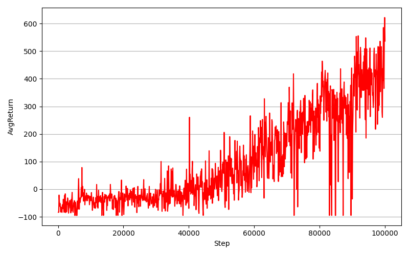
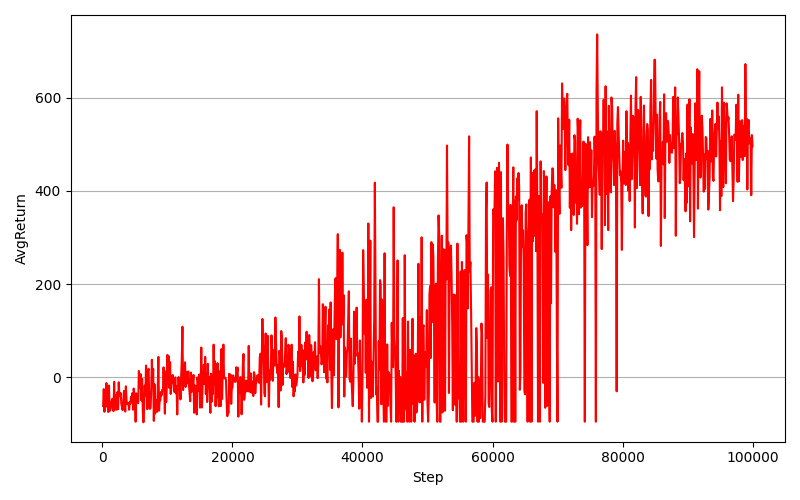

# DQN for CarRacing-v3 (Gymnasium)

본 프로젝트는 `CarRacing-v3` 환경에서 DQN 및 Dueling DQN을 활용하여 자율주행 학습을 수행하는 강화학습 프로젝트입니다.  
이미지 기반 관측(observation)을 처리하기 위해 CNN 기반의 모델을 사용하였으며, 주요 하이퍼파라미터 변화에 따른 성능 비교 실험을 수행했습니다.

## 📁 폴더 구조
```bash
├── checkpoints # 학습된 모델 가중치 (.pt)
├── logs # 학습 그래프 이미지 (.png)
├── DQN_CarRacing
│ ├── DQN_CarRacing.py # 메인 학습 스크립트
│ ├── requirements.txt
│ └── src
│   ├── CNN.py # 이미지 feature extractor
│   ├── DQN.py # DQN 클래스
│   ├── Dueling_DQN.py# Dueling DQN 클래스
│   ├── Preprocess.py # 이미지 전처리 및 상태 stack
│   └── init.py
└── README.md
```

---

## 실행 방법

### 1. 패키지 설치
```bash
pip install -r requirements.txt
pip install box2d-py
```

2. 학습 실행
기본 DQN 모델 학습 실행:
```bash
python DQN_CarRacing/DQN_CarRacing.py
```

다양한 설정을 주고 실행할 수 있습니다:
```bash
python DQN_CarRacing/DQN_CarRacing.py --gamma 0.9 --eps-decay 0.995 --model DQN
python DQN_CarRacing/DQN_CarRacing.py --gamma 0.95 --eps-decay 0.99 --model DuelingDQN
```
실험 결과
- 학습 도중 일정 스텝마다 에이전트를 평가하고 평균 리턴(AvgReturn)을 기록했습니다. 성능이 향상될 때마다 모델이 저장되며, 최종 그래프는 logs/에 저장됩니다.

성능이 향상될 때마다 모델은 checkpoints/에 저장되며, 학습 그래프는 logs/에 저장됩니다.


- γ=0.9, ε-decay=0.995 (DQN): 초기 학습 속도가 빠르나, 장기적으로 변동성이 큼.


- γ=0.95, ε-decay=0.99 (DoubleDQN + DuelingDQN): 안정적인 학습 곡선을 보이며, 최종 리턴이 더 높음.


참고 사항
- 전처리: Preprocess.py는 입력 이미지를 회색조로 변환하고 84x84로 리사이징한 뒤, 4개의 연속 프레임을 쌓아 시간적 정보를 포함한 상태로 사용합니다.
- 평가: evaluate() 함수는 5번의 에피소드 평균 리턴을 계산하며, 10,000 스텝마다 평가를 수행합니다.
- 모델 저장: 최적 성능의 모델은 checkpoints/에 자동 저장됩니다.
evaluate() 함수는 학습 중 일정 간격마다 5번의 평가를 통해 평균 리턴을 산출합니다.